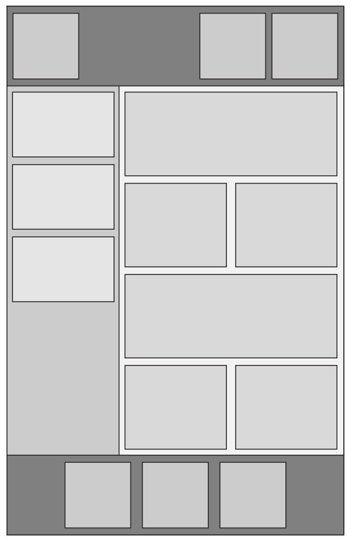

# HTML and CSS Layout challenge

- As a front end developer, you will often be handed figma files from a designer that you then have to build. You will need to be able to take a graphic file and recreate it with code. This means that you'll have to be able to think through how you're going to get all the elements in that figma file where they need to be, and that requires a solid understanding of how to position HTML elements with CSS.

# Tips:
Remember, we've talked about several ways to position elements on the page. These include but are not necessarily limited to:

- `display: block` `display: inline-block`, `display: flex`, `position: relative`, `position: absolute`, `margin`, and `padding`.

If the layout dictates, some of the divs may be nested within other divs. Use your best judgement!
See how many different ways you can achieve the same result and consider the pros/cons of solution!

# Layout to build

